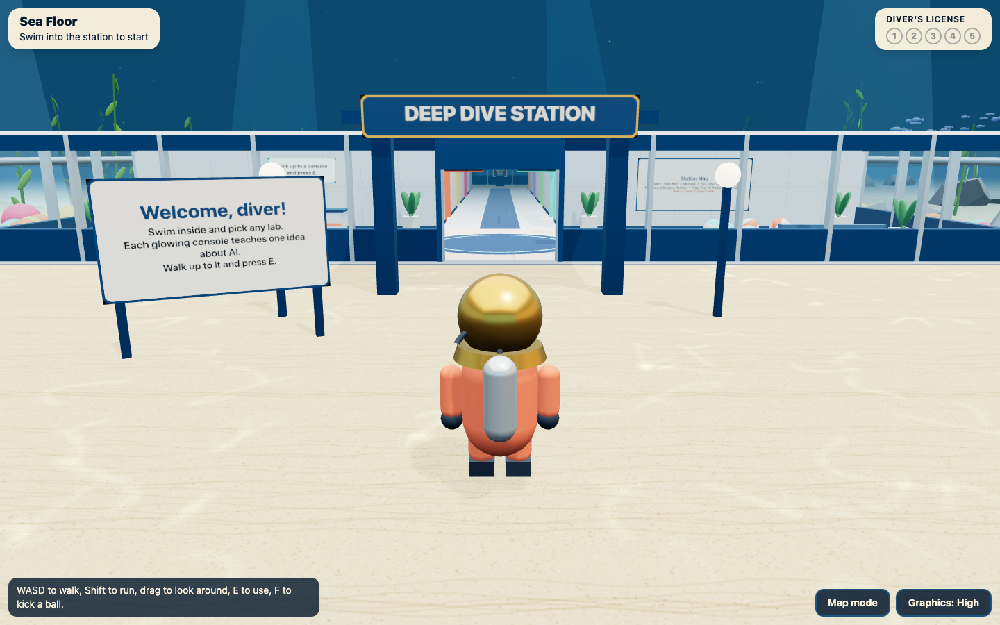
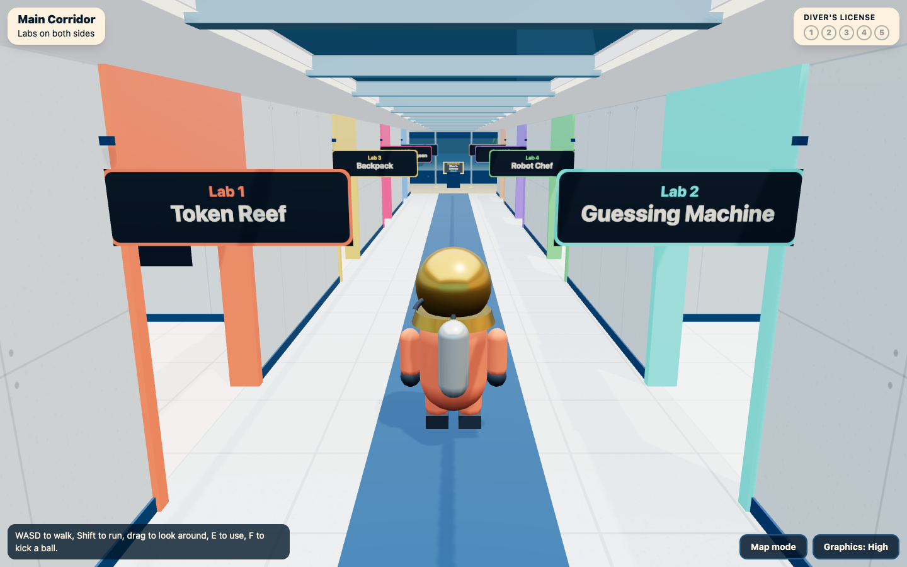
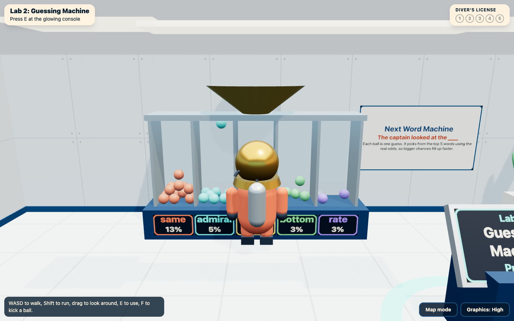
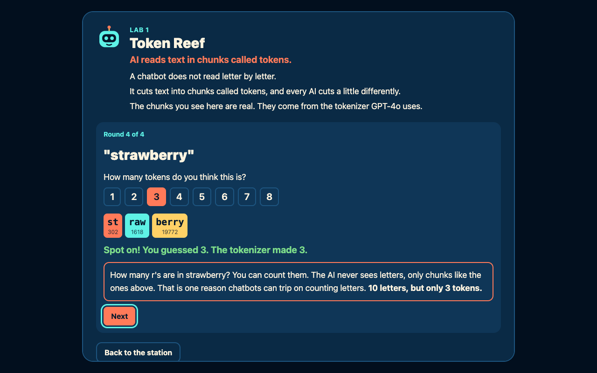
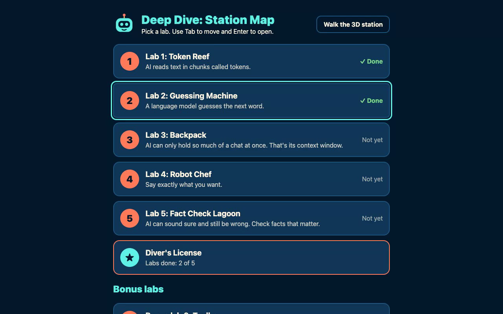

# Deep Dive

**Play it:** https://deep-dive-rosy.vercel.app

Deep Dive is a free 3D browser game for kids ages 10 to 14. You walk a diver through an underwater research station, and each lab bay teaches one thing about how AI chatbots actually work: a short explanation from Pip the robot, plus a mini game that runs the real mechanism, shrunk to kid size. It takes about 20 minutes, needs no account, and a kid can play it alone.

Built solo for OwlHacks 2026. Track: HCI.



## The station

You start on the sandy sea floor outside the station, walk through the airlock into the lobby (Pip the robot greets you, and there are beach balls to kick), then down a corridor lined with lab rooms, 4 on each side. Every room is built out for its lesson: a reef tank of token blocks, a kitchen for Robot Chef, bookshelves for the Library, a workbench and weather station for the Toolbox. Walk up to the glowing console in any room and press E to start its lesson. The Diver's License waits on the Captain's Deck at the end.



Two rooms have hands-on 3D physics that run the lesson's real logic:

- **Next Word Machine** (Lab 2): balls drop into 5 tubes labeled with the model's real top 5 words after "The captain looked at the". Each ball is one guess, sampled with the real odds, so the likeliest word's tube fills fastest.
- **Backpack belt** (Lab 3): each chat message becomes a block as long as its real token count. They slide into a 60-token trough using the same code as the lesson, and the oldest block falls off the end when it's full.



## Why

- **"84% of students use AI, but only 16% are being taught to understand it."** Code.org, 2025 State of AI + CS Education Report. The 16% is high school leaders saying all of their students learn about AI. Only four states have formal AI education standards, and 14 require AI or CS for graduation. https://advocacy.code.org/stateofcs/
- **Philadelphia:** the School District of Philadelphia approved two generative AI tools, Google Gemini and Adobe Express with Firefly, "for staff and student use." Its listed AI training is an asynchronous course, "Understanding Data Privacy and AI Fundamentals," in the staff learning system. No student lessons are listed. https://www.philasd.org/pstv/ai-resources/

Free AI curricula do exist (Code.org How AI Works, MIT Day of AI, Experience AI from Google DeepMind and the Raspberry Pi Foundation). They are teacher-led and adopted school by school. Most kids never get them, and none of them are something a kid can pick up and play alone. Deep Dive is built for that gap.

## The labs

Five core labs, then three bonus labs. Finishing the five core labs earns the **Diver's License**, which lists every rule you learned.

| # | Lab | The rule | AI4K12 Big Idea |
|---|---|---|---|
| 1 | Token Reef | AI reads text in chunks called tokens. | Representation and Reasoning |
| 2 | Guessing Machine | A language model guesses the next word. | Learning |
| 3 | Backpack | AI can only hold so much of a chat at once. That's its context window. | Representation and Reasoning |
| 4 | Robot Chef | Say exactly what you want. | Natural Interaction |
| 5 | Fact Check Lagoon | AI can sound sure and still be wrong. Check facts that matter. | Societal Impact |
| 6 | Toolbox (bonus) | Tools make AI more reliable. An agent picks its own tools. | Representation and Reasoning |
| 7 | Library (bonus) | AI only knows what it read. | Learning, Societal Impact |
| 8 | Safe Harbor (bonus) | Some things you never tell a chatbot. | Societal Impact |

Perception, the first AI4K12 Big Idea, is not covered.



## What is real in each lab

Nothing in Deep Dive fakes a token split or a probability. They are computed live in the browser.

- **Token Reef** runs the real **o200k_base tokenizer, the one GPT-4o uses** (js-tiktoken). Kids guess how many tokens a word is, then see the real chunks and their token numbers. "strawberry" comes out as st, raw, berry, which shows why chatbots can trip on counting letters. Type your own name and see how it gets cut.
- **Guessing Machine** is a **real language model that trains in your browser**: a word-level trigram model with bigram backoff, built from 63,507 words of three public-domain books. "The captain looked at the ___" shows its real top 5 guesses as probability bars. Story mode has a temperature dial: ice cold gets stuck repeating itself, red hot turns silly. The lesson calls it "a tiny language model, a great-great-grandparent of ChatGPT: same job, way smaller."
- **Backpack** is a 60-token context window. Every chat message is weighed by the real GPT-4o tokenizer. Chat with Pip, then ask "What's my dog's name?" If the first message fell out, Pip guesses wrong. Pin it, or toss the small talk, and Pip gets it right.
- **Robot Chef** is scripted on purpose, not a model: Pip's birthday card is assembled only from the prompt cards the kid picked, so every missing card shows up in the result. Stars are scored on the finished card.
- **Fact Check Lagoon** has Pip state five sea facts, each "99% sure." Two are surprising but true, three are wrong or made up. Every Field Guide fact links to a NOAA page that was opened and checked on 2026-09-26.
- **Toolbox** has a real calculator (4,839 x 27 is computed, not written down) and a pretend weather tool. In agent mode Pip proposes its own steps, and the kid approves or denies each one, including one step nobody asked for.
- **Library** retrains the same language model on whichever books the kid picks, live. Aesop alone makes Pip talk about foxes and lions. Treasure Island alone makes it talk about captains and doctors. That is the bias lesson.
- **Safe Harbor** is a sorting game about what to keep private.

## Kid safety

Shown on the start screen for teachers and parents:

> No accounts. No chatting with a live AI. Nothing you type leaves this page. Works offline once it loads.

It is a static site. There is no server, no database, no login, no analytics, and no API keys. The app makes zero API calls: the tokenizer, the language model and the books all run or live in the browser, and after the first load every lab is prefetched so it keeps working offline. A kid's name on the Diver's License lives only in page memory.

## Accessibility (the HCI part)



- **Map mode** opens every lab as a plain list, with the same lessons and no 3D. It never downloads three.js, so it works on slow school Chromebooks and on computers without WebGL.
- Everything in Map mode works with a keyboard alone: native buttons, radio groups, sliders and dialogs, with a visible focus ring. We checked this with scripted Playwright runs on the live site that play all five core labs and the license using only Tab, arrows, Space and Enter.
- It respects `prefers-reduced-motion`: animations turn off in the lessons and in the 3D station (fish, kelp, light ripples and glowing consoles hold still), and the start screen points those kids to Map mode first.
- The 3D station has a **Graphics: High / Low** switch. Low drops shadows, light rays and most of the fish and kelp, and it's picked automatically on computers with 4 or fewer processor cores. Still meshes are merged when the station loads (about 870 draw calls down to about 270), and it holds 60 frames per second on a laptop GPU.
- Phones and tablets are pointed to Map mode, since the 3D station has no touch controls.
- Every lab has **Read to me**, with narration recorded once ahead of time. If a clip can't load, the browser's own voice reads it instead.
- Copy is written at about a grade 5 reading level, 2 to 4 short sentences per lesson. Pip says AI "guesses" or "predicts," never "knows" or "thinks."

## Limitations

- **Perception is not covered.** No lab teaches how AI sees or hears.
- The Guessing Machine is a trigram model, not a transformer. It shows the job a language model does (guess the next word), not how modern models compute it. It lowercases everything.
- Token Reef and Backpack use GPT-4o's tokenizer. Other chatbots cut text differently, and the lesson says so.
- In the Backpack the oldest message falls out. Real apps handle a full context window in different ways, like summarizing, and the lesson says that too.
- Robot Chef's Pip and the Toolbox weather tool are scripted, not live AI.
- The 3D station needs WebGL2 and a keyboard or mouse. The camera never turns by itself, so keyboard-only players can walk but not look around, and there are no touch controls. Map mode covers all of these.
- The Next Word Machine only drops balls into the top 5 words; the lesson itself shows the full odds.
- Keyboard-only play was tested with scripted runs, not yet with a real screen reader user.
- Progress is not saved between visits. That is on purpose: nothing is stored.
- English only.
- The lesson copy is waiting on a final accuracy review. See `LESSONS.md`; lines marked [CHECK] are still open.

## Public-domain books

The language model reads excerpts (about 100 KB each) of three public-domain books from Project Gutenberg. The license headers and illustration notes were removed.

- *Twenty Thousand Leagues Under the Sea* by Jules Verne. https://www.gutenberg.org/ebooks/164
- *Treasure Island* by Robert Louis Stevenson. https://www.gutenberg.org/ebooks/120
- *Aesop's Fables*, a new translation by V. S. Vernon Jones (1912). https://www.gutenberg.org/ebooks/11339. For a kid audience, this translation's word "ass" (meaning donkey) was replaced with "donkey."

Fact Check sources: NOAA Ocean Service, NOAA Fisheries, NOAA National Marine Sanctuaries and NOAA Ocean Today, linked inside the game.

## AI disclosure

Deep Dive was built with **Claude Code** (Anthropic's AI coding agent), directed and reviewed by Ethan during OwlHacks 2026. **No AI runs at runtime:** the game never calls an AI service and needs no keys. The only AI service touched at build time was ElevenLabs, used once to pre-record the Read to me narration (1,911 characters, `scripts/narrate.ts`). The MP3s ship as static files.

## Run it yourself

```bash
npm install
npm run dev        # local dev server
npm test           # node --test: unit tests for every lab's logic.ts
npm run lessons    # regenerate LESSONS.md from src/content.ts
npm run build      # type check + production build
```

Stack: Vite, React 19, TypeScript, Tailwind 4, three.js with @react-three/fiber, drei, rapier and ecctrl for the diver, js-tiktoken for the tokenizer. Deployed as a static site on Vercel. The station is built from simple shapes, and every texture (tiles, wall panels, sand, signs) is painted on a canvas in the browser, so the 3D world downloads no images or models.

All lesson text lives in `src/content.ts`. Each lab is `src/lessons/<lab>/Lesson.tsx` (the screen), `logic.ts` (pure logic) and `logic.test.ts`.

## Prior art

Code.org AI for Oceans teaches how a classifier learns, not how a chatbot works. Google AI Quests is a scenario game about real research problems. LLM Odyssey (Tufts) has mini-games on tokens and prompting for college students, in a menu format. Between Tokens is a short adult piece where you play the language model. We did not find a K-12 game about AI making things up, or about tools and agents.
